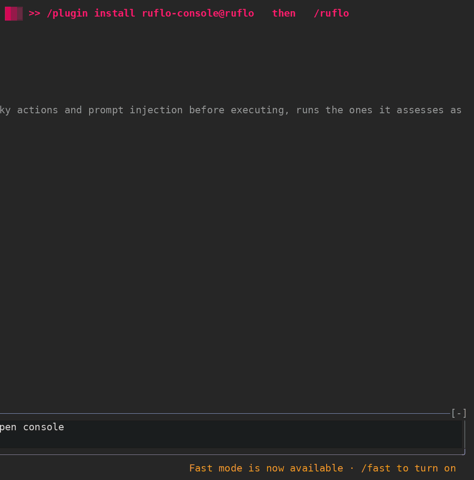

<div align="center">

[](https://cognitum.one/agentic-engineering)

<!-- Try Ruflo — the 3 badges first-time visitors actually act on -->
[](https://www.npmjs.com/package/ruflo)
[](https://opensource.org/licenses/MIT)
[](https://github.com/ruvnet/claude-flow)

<!-- Ecosystem strip (collapsed visually with flat-square) -->
[](https://github.com/ruvnet/ruvector)
[](https://github.com/ruvnet/ruflo/blob/main/data/clone-data.proof.json)
[](https://github.com/ruvnet/ruflo/blob/main/data/clone-data.ledger.json)
[](https://github.com/ruvnet/claude-flow)
[![Codex Plugin](https://img.shields.io/badge/Codex-Plugin-412991?style=flat-square&logoColor=white&logo=data%3Aimage%2Fsvg%2Bxml%3Bbase64%2CPHN2ZyB4bWxucz0iaHR0cDovL3d3dy53My5vcmcvMjAwMC9zdmciIHZpZXdCb3g9IjAgMCAyNCAyNCI%2BPHBhdGggZmlsbD0id2hpdGUiIGQ9Ik0yMi4yODIgOS44MjFhNS45ODUgNS45ODUgMCAwIDAtLjUxNi00LjkxIDYuMDQ2IDYuMDQ2IDAgMCAwLTYuNTEtMi45QTYuMDY1IDYuMDY1IDAgMCAwIDQuOTgxIDQuMThhNS45ODUgNS45ODUgMCAwIDAtMy45OTggMi45IDYuMDQ2IDYuMDQ2IDAgMCAwIC43NDMgNy4wOTcgNS45OCA1Ljk4IDAgMCAwIC41MSA0LjkxMSA2LjA1MSA2LjA1MSAwIDAgMCA2LjUxNSAyLjlBNS45ODUgNS45ODUgMCAwIDAgMTMuMjYgMjRhNi4wNTYgNi4wNTYgMCAwIDAgNS43NzItNC4yMDYgNS45OSA1Ljk5IDAgMCAwIDMuOTk4LTIuOSA2LjA1NiA2LjA1NiAwIDAgMC0uNzQ3LTcuMDczek0xMy4yNiAyMi40M2E0LjQ3NiA0LjQ3NiAwIDAgMS0yLjg3Ni0xLjA0bC4xNDItLjA4IDQuNzc4LTIuNzU4YS43OTUuNzk1IDAgMCAwIC4zOTMtLjY4MXYtNi43MzdsMi4wMiAxLjE2OGEuMDcxLjA3MSAwIDAgMSAuMDM4LjA1MnY1LjU4M2E0LjUwNCA0LjUwNCAwIDAgMS00LjQ5NSA0LjQ5NHpNMy42IDE4LjMwNGE0LjQ3IDQuNDcgMCAwIDEtLjUzNS0zLjAxNGwuMTQyLjA4NSA0Ljc4MyAyLjc1OWEuNzcxLjc3MSAwIDAgMCAuNzgxIDBsNS44NDMtMy4zNjl2Mi4zMzJhLjA4LjA4IDAgMCAxLS4wMzMuMDYyTDkuNzQgMTkuOTVhNC41IDQuNSAwIDAgMS02LjE0LTEuNjQ2ek0yLjM0IDcuODk2YTQuNDg1IDQuNDg1IDAgMCAxIDIuMzY2LTEuOTczVjExLjZhLjc2Ni43NjYgMCAwIDAgLjM4OC42NzdsNS44MTUgMy4zNTQtMi4wMiAxLjE2OGEuMDc2LjA3NiAwIDAgMS0uMDcyIDBsLTQuODMtMi43ODZBNC41MDQgNC41MDQgMCAwIDEgMi4zNCA3Ljg3MnptMTYuNTk3IDMuODU1LTUuODMzLTMuMzg3IDIuMDE2LTEuMTY1YS4wNzYuMDc2IDAgMCAxIC4wNzEgMGw0LjgzIDIuNzkxYTQuNDk0IDQuNDk0IDAgMCAxLS42NzYgOC4xMDR2LTUuNjc3YS43OS43OSAwIDAgMC0uNDA3LS42Njd6bTIuMDEtMy4wMjMtLjE0MS0uMDg1LTQuNzc0LTIuNzgyYS43NzYuNzc2IDAgMCAwLS43ODUgMEw5LjQwOSA5LjIzVjYuODk3YS4wNjYuMDY2IDAgMCAxIC4wMjgtLjA2Mmw0LjgzLTIuNzg3YTQuNDk5IDQuNDk5IDAgMCAxIDYuNjggNC42NnpNOC4zMDcgMTIuODYzbC0yLjAyLTEuMTY0YS4wOC4wOCAwIDAgMS0uMDM4LS4wNTdWNi4wNzRhNC40OTkgNC40OTkgMCAwIDEgNy4zNzYtMy40NTRsLS4xNDIuMDgtNC43NzggMi43NThhLjc5NS43OTUgMCAwIDAtLjM5My42ODJ6bTEuMDk3LTIuMzY2IDIuNjAyLTEuNSAyLjYwNyAxLjV2Mi45OTlsLTIuNTk3IDEuNS0yLjYwNy0xLjVaIi8%2BPC9zdmc%2B)](https://www.npmjs.com/package/@claude-flow/codex)

# Ruflo

[English](README.md) · [简体中文](README.zh-CN.md) · [한국어](README.ko.md)

**Claude Code와 Codex를 위한 에이전트 메타 하네스(harness).**

[](docs/ruflo-explained.ko.md)

**[📖 RuFlo Explained — 계획하고, 기억하고, 테스트하고, 개선하는 AI 팀 만들기](docs/ruflo-explained.ko.md)**
기본 개념부터 처음으로 쓸모 있는 작업까지, 이어서 메모리, 에이전트 팀, 플러그인, 비용과 검증을 다루는 14장 구성의 가이드입니다.

</div>

<!-- ko-fork:start — 이 절은 한국어 포크에만 있습니다(원문 README에 없음). -->
## 한국어판(이 포크) 안내

이 저장소는 [ruvnet/ruflo](https://github.com/ruvnet/ruflo)를 포크해 한국어로 옮긴 판입니다. 아래 본문은 원문 README의 번역이고, **설치와 업데이트는 이 절의 방법을 따르세요.** `npx ruflo@latest`나 `npm install -g ruflo`는 npm에 있는 원본(영어판)을 받습니다.

**한국어로 바뀐 것**

- CLI: 모든 명령의 도움말, 주요 9개 명령(`init`·`start`·`status`·`doctor`·`agent`·`swarm`·`memory`·`task`·`session`)의 메시지, 대화형 질문
- Claude Code 에셋: 에이전트·명령·스킬의 머리말 `description`(본문은 영어 그대로), 플러그인 46개의 마켓플레이스 설명
- 모드 플러그인 3종: `/ruflo` 콘솔(ruflo-console), ruflo-mods, ruflo-swarm의 화면 문구
- `ruflo init`이 만드는 `CLAUDE.md`의 `## 언어` 절(Claude가 한국어로 답하게 함)
- 문서: 이 README와 [입문 가이드](docs/ruflo-explained.ko.md)

### 설치

```bash
git clone https://github.com/0x-mw/ruflo.git
cd ruflo && git checkout ko
bash scripts/i18n/install-ko.sh
ruflo --version    # ruflo v3.53.0 (ko)
```

- 필요한 것: Node.js 20 이상, git, rsync, corepack(pnpm 8.15.0을 corepack으로 씁니다).
- `install-ko.sh`가 하는 일: 작업본을 `~/.cache/ruflo-ko-build`에 복사해 빌드 → 번역 검사 → 릴리스 워크플로와 같은 방식으로 패키징 → `npm install -g` → 플러그인 마켓플레이스 고정 스냅숏(`~/.local/share/ruflo-ko/marketplace`) 생성. 단계마다 진행 상황을 출력하고, 실패하면 단계 이름을 알려 줍니다.
- 옵션: `--no-global`(전역 설치 없이 패키지만 만듦), `--skip-build`, `--tools-only`(pnpm 심만 만듦), `--force`(커밋 안 된 변경·전역 점검 경고를 무시).

### 프로젝트에 적용

```bash
cd <프로젝트 폴더>
ruflo init --no-mods
ruflo mods install --scope project --source local --marketplace-path ~/.local/share/ruflo-ko/marketplace
```

- `--no-mods`로 원본(GitHub) 플러그인 설치를 건너뛰고, 다음 줄에서 한국어 스냅숏의 모드 플러그인을 설치합니다.
- `.mcp.json`의 MCP 서버는 전역 설치본(`ruflo mcp start`)으로 등록됩니다.
- Claude Code를 다시 시작한 뒤 `/ruflo`를 실행하면 한국어 콘솔이 열립니다. 처음 실행할 때 폴더 신뢰와 MCP 서버(`claude-flow`) 승인을 물으면 승인합니다.
- 터미널에서 `ruflo init`을 처음 실행하면 `--no-signup`을 줘도 Cognitum 계정 안내 질문이 한 번 나옵니다(원본 버그). Enter를 누르면 기본값(No)으로 넘어갑니다.
- 콘솔이 원본 저장소의 새 버전을 알리며 업데이트할지 물으면 "나중에"를 고르고, 콘솔 설정의 "업데이트"를 off로 바꿔 두세요(아래 한계 참고).

### 언어 바꾸기

- CLI는 터미널(TTY)에 출력할 때만 한국어입니다. 파이프·리디렉션, `--json` 같은 기계용 출력, MCP 서버, 훅은 항상 영어라서 스크립트와 자동화 결과가 바뀌지 않습니다.
- `RUFLO_LANG=en ruflo …`는 영어로, `RUFLO_LANG=ko ruflo …`는 파이프에서도 한국어로 출력합니다.
- 콘솔 등 플러그인 화면은 Claude Code가 받은 `RUFLO_LANG`을 따릅니다. `RUFLO_LANG=en claude`로 실행하거나, 프로젝트의 `.claude/settings.local.json`에 `"env": { "RUFLO_LANG": "en" }`을 넣으면 영어로 나옵니다.

### 업데이트와 되돌리기

- **`npm update -g`나 `npm install -g ruflo`·`@claude-flow/cli`를 쓰지 마세요.** 패키지 이름과 버전(`@claude-flow/cli@3.53.0`)이 원본과 같아서 영어판으로 덮어씁니다. 한국어판인지는 `ruflo --version`의 `(ko)` 표시로 확인합니다.
- 갱신: `git pull` 뒤 `bash scripts/i18n/install-ko.sh`를 다시 실행합니다. Node 버전을 바꾼 뒤에도 다시 실행해야 합니다(전역 설치 위치가 Node 버전마다 다름).
- 원본 변경 따라가기(포크 관리자용):
  1. `node scripts/i18n/apply-descriptions.mjs --revert` 후 커밋
  2. `git fetch upstream && git merge upstream/main`
  3. `node scripts/i18n/extract.mjs`로 새 문구를 샤드(`i18n/ko/`)에 넣고 번역
  4. `node scripts/i18n/build.mjs` → `node scripts/i18n/apply-descriptions.mjs` → `node scripts/i18n/check.mjs --strict`
  5. 커밋 후 `bash scripts/i18n/install-ko.sh`
  - 번역 도구는 TypeScript·yaml 파서를 `~/.cache/ruflo-ko-build`에서 찾으므로 `install-ko.sh`를 한 번 실행한 뒤에 씁니다.
- 되돌리기: 프로젝트에서 `ruflo mods uninstall` → `claude plugin marketplace remove ruflo` → `npm uninstall -g @claude-flow/cli`. 설명만 영어로 되돌리려면 `node scripts/i18n/apply-descriptions.mjs --revert`.

<details>
<summary><strong>알려진 한계</strong></summary>

- **번역 범위**: 주요 9개 명령 밖의 실행 메시지, 실행 중에 조합되는 문장, `console.*`로 바로 찍히는 출력은 영어로 남습니다.
- **사용자 데이터는 번역하지 않습니다**: 표 셀과 상태값(예: `running`)은 원문 그대로입니다. 반대로 사용자 데이터가 사전의 문구와 정확히 같으면 번역되어 보일 수 있습니다.
- **모델이 읽는 글은 영어**: 에이전트·명령·스킬 본문, MCP 도구 설명, 헬퍼·상태줄(`.claude/helpers`, 서명된 파일)은 바꾸지 않았습니다.
- **description 번역과 자동 선택**: 스킬·에이전트의 `description`은 Claude가 무엇을 쓸지 고르는 단서라서, 영어로 요청하면 자동 선택 정확도가 떨어질 수 있습니다. 핵심 영어 용어를 괄호로 같이 적었고 `name`은 바꾸지 않았습니다. 되돌리려면 `apply-descriptions.mjs --revert`를 씁니다.
- **기존 CLAUDE.md**: `ruflo init`은 이미 있는 `CLAUDE.md`를 덮지 않습니다. 기존 프로젝트에는 아래 절을 직접 붙이세요. `ruflo init --force`는 기존 파일을 `CLAUDE.md.pre-ruflo`로 백업한 뒤 새로 쓰지만, 다른 init 파일도 다시 씁니다.

  ```markdown
  ## 언어

  - 사용자에게 하는 모든 응답·설명·요약·질문은 한국어로 작성한다.
  - 코드, 명령어, 파일 경로, 식별자, 로그·오류 원문, 도구 이름과 인자는 원문 그대로 둔다.
  - 커밋 메시지와 코드 주석은 저장소의 기존 언어 관례를 따른다.
  ```
- **`npx ruflo@latest` 안내**: `doctor`·`swarm` 등이 출력하는 `npx -y ruflo@latest …` 안내는 원본 문구 그대로입니다. 그대로 실행하면 영어판을 받으므로 `ruflo …`로 바꿔 실행하세요.
- **콘솔 업데이트 확인**: 콘솔의 업데이트 확인은 원본 저장소를 봅니다. 콘솔 설정에서 Updates를 꺼 두는 것을 권합니다.
- **마켓플레이스는 설정 폴더마다 하나**: 플러그인 마켓플레이스 `ruflo`는 Claude Code 설정 폴더마다 하나만 등록됩니다. 다른 프로젝트에서 기본 옵션으로 `ruflo init`(모드 플러그인을 GitHub 원본에서 받음)을 실행하면 원본 마켓플레이스로 바뀝니다.
- **마켓플레이스 스냅숏**: 마켓플레이스는 작업본이 아니라 설치할 때 만든 고정 스냅숏을 가리킵니다. 플러그인 변경을 반영하려면 `install-ko.sh`를 다시 실행합니다.
- **witness 매니페스트**: `verification/*/manifest.md.json`은 원본 러너가 서명한 기록이라 갱신하지 않았습니다. 콘솔 evolve 화면에 드리프트가 보이는 것은 정상입니다.
- **명령 카탈로그**: `catalog.generated.json`은 원본 그대로입니다. 원본에서도 이미 소스와 어긋나 있어 `ruflo catalog generate --check`가 실패하므로 다시 만들지 않았습니다. 카탈로그에는 설명 문구가 없어 화면에는 영향이 없습니다.
- **화면 폭**: 좁은 창에서는 일부 화면(설정, room 목록 등)의 한글이 잘릴 수 있습니다.
- **검색**: 팔레트와 도움말 검색은 원문과 번역문을 모두 찾습니다. 그 밖의 검색 입력은 영어 기준입니다.
- **`claude -p`에서 콘솔**: 비대화형 실행에서 `dump`·`open` 응답은 영어 원문, `help`·`status` 등 나머지 응답은 한국어입니다.
- **PATH**: 전역 설치본은 nvm의 Node 아래에 있습니다. PATH에 nvm이 없는 환경(예: 다른 PATH로 띄운 GUI)에서 Claude Code를 실행하면 `.mcp.json`의 `ruflo`와 훅이 쓰는 `node`를 찾지 못합니다. nvm이 잡힌 터미널에서 `claude`를 실행하세요.

</details>
<!-- ko-fork:end -->

> **에이전트 = 모델 + 하네스.** 모델은 코드를 쓰고, 하네스는 모델이 실제로 일할 수 있도록 도구, 메모리, 루프, 샌드박스, 제어 장치를 제공합니다. **Ruflo가 바로 그 하네스입니다.** Claude Code와 Codex를 감싸는 실행 계층으로, 100개 이상의 전문 에이전트, 조율되는 스웜, 자가 학습 메모리, 머신 간 페더레이션 통신, 엔터프라이즈 보안 가드레일을 더합니다. 에이전트가 단순히 실행되는 데 그치지 않고 협업하게 됩니다.

`npx ruflo init` 한 번이면 Claude Code에 신경계가 생깁니다. 에이전트가 스스로 스웜을 구성하고, 모든 작업에서 배우며, 세션이 바뀌어도 기억합니다. 페더레이션을 쓰면 데이터 유출 없이 다른 머신의 에이전트와도 안전하게 통신합니다. 코드만 계속 작성하면 됩니다. 조율은 Ruflo가 맡습니다.

```
Self-Learning / Self-Optimizing Agent Architecture

User --> Ruflo (CLI/MCP) --> Router --> Swarm --> Agents --> Memory --> LLM Providers
                          ^                           |
                          +---- Learning Loop <-------+
```

> **Ruflo가 처음이신가요?** MCP 도구 314개나 CLI 명령어 26개를 익힐 필요는 없습니다. `init` 이후에는 평소처럼 Claude Code를 쓰기만 하면 됩니다. 훅 시스템이 작업을 자동으로 라우팅하고, 성공한 패턴에서 배우며, 백그라운드에서 에이전트를 조율합니다.

<details>
<summary><strong>📖 배경 — 이름의 유래</strong></summary>

> Claude Flow는 이제 Ruflo입니다. Rust와 몰입 상태(flow state), 그리고 필연처럼 느껴지는 것을 만드는 일을 사랑하는 [`rUv`](https://ruv.io)가 이름을 지었습니다. "Ru"는 rUv이고, "flo"는 새벽 3시까지 일한다는 뜻입니다. 내부에서는 [`Cognitum.One`](https://cognitum.one/?RuFlo) 에이전틱 아키텍처가 구동하며, 강화된 Rust 기반 AI 엔진, 임베딩, 메모리, 플러그인 시스템이 돌아갑니다.

</details>

---

<p align="center"></p>

<sub>Claude Code에서 실행되는 <code>/ruflo</code> 콘솔을 콤팩트한 거의 정사각형 프레임(Claude 옆에 도킹한 콕핏 부분만 잘라낸 화면)으로 표시합니다. 휴대폰에서도 데스크톱에서도 읽기 좋습니다. 전체 부팅 과정(테두리의 네온 사인, 실제로 설치된 구성 요소에 따라 불이 켜지는 ruvector 별자리, 모든 영역 점검, 이스터 에그), 메인 메뉴 등장과 카드 접힘, 그룹별 내비게이션, 스무 개 남짓한 화면 둘러보기(스웜 토폴로지, 페더레이션 지도, tmux·RVF·RVM용 샌드박스 화면, 비용, 메모리, 개발 도구 등), 명령 팔레트(모든 항목에 기능을 알려 주는 태그 표시), <b>ruHelp</b>(내장 도움말: 질문하면 버튼이 달린 단계별 안내를 제공하며, 모든 기능에 가이드가 있음), 설정과 새로고침이 담겨 있습니다. <a href="docs/assets/ruflo-console-walkthrough-wide.gif">와이드 디스플레이 둘러보기</a>는 같은 콘솔을 모든 라벨이 들어갈 만큼 넓은 화면으로 표시합니다. <code>npx ruflo init</code>을 실행하고 Claude Code를 다시 시작한 뒤 <code>/ruflo</code>를 실행하세요.</sub>

**Claude가 콘솔을 직접 조작하게 하세요.** 콘솔은 Claude가 조작할 수도 있습니다. 제어를 켜면(설정 → Claude control) Claude가 네 가지 도구(`console_state`, `console_open`, `console_set`, `console_run`)를 받아 미션을 설정하고, 학습 랩이나 보안 화면을 열고, 팔레트 항목을 실행하며, 콕핏에는 그 과정이 그대로 표시됩니다. Claude가 어디까지 할 수 있는지는 설정(`read`, `write`, `manage`, `full`)에 달려 있으며, 수준을 넘는 동작은 거부되고 아무것도 실행되지 않습니다. 또한 사용자의 Yes를 기다릴지(`ask`) 스스로 확인하고 진행할지(`auto`)도 정할 수 있습니다. 개요 화면에는 모든 동작의 실시간 로그와, 모든 동작을 한 번에 멈추는 **제어권 되찾기** 버튼이 표시됩니다. 기본값은 꺼짐입니다. [ADR-444](v3/docs/adr/ADR-444-claude-controls-the-console.md)를 참고하세요.

<p align="center"></p>

<sub>실제 녹화 영상입니다(Claude Haiku, 비용 몇 센트). 제어는 자동 확인을 켠 <code>write</code>로 설정했습니다. 목표를 설정하고 미션을 생성하는 것은 이 수준에서 가능하지만, 스웜 중지는 <code>full</code>이 필요하므로 거부됩니다. <b>제어권 되찾기</b> 이후에는 모든 호출이 거부됩니다.</sub>

**ruflo 마켓플레이스에서 mod(훅 기반 확장 단위)를 설치하세요** (Claude Code 2.1.287 이상 필요. mod는 계정 권한으로 실행되며 샌드박스에서 동작하지 않으므로 먼저 코드를 읽어 보세요):

```text
/plugin marketplace add ruvnet/ruflo
/plugin install ruflo-console@ruflo
/plugin install ruflo-mods@ruflo
/reload-plugins
```

`ruflo-console`은 위에서 본 콕핏이고, `ruflo-mods`는 프롬프트를 라우팅하고 정책을 프로세스 내에서 적용하며, `ruflo-swarm`은 스웜을 패널에 표시하고, `ruflo-ruos`는 ruOS 상태 세그먼트를 추가합니다. `/plugin`을 열어 활성 mod 줄에 표시되는지 확인하세요. 콘솔 안의 `/ruflo market`은 플러그인 카탈로그입니다. 모든 ruflo 플러그인, mod, 스킬이 무엇을 제공하는지 표시하며, 설치, 활성화, 비활성화, 업데이트 버튼이 있습니다(각각 먼저 묻습니다).

## 빠른 시작

설치 방법은 **두 가지**이며, 설치되는 범위가 크게 다릅니다. 필요한 것에 맞춰 고르세요 (#1744):

| | **Claude Code 플러그인** | **CLI 설치 (`npx ruflo init`)** |
|---|---|---|
| 제공하는 것 | 플러그인별 슬래시 명령어 + 스킬 몇 개 + 에이전트 정의 | Ruflo 전체 루프 — 에이전트 98개, 명령어 60개 이상, 스킬 30개, MCP 서버, 훅, 데몬 |
| 워크스페이스에 생기는 파일 | **없음** | `.claude/`, `.claude-flow/`, `CLAUDE.md`, 헬퍼, 설정 |
| MCP 서버 등록 | `ruflo-core`를 설치한 경우에만 (자체 `.mcp.json`을 포함) — 다른 플러그인 대부분은 등록하지 않음 | 등록됨 |
| 훅 설치 | 설치 안 됨 | 설치됨 |
| 적합한 용도 | 전체 설치 없이 플러그인 하나의 명령어만 써 보기 | 프로덕션 사용 — 문서에 적힌 대로 모든 기능이 동작 |

### 방법 A — Claude Code 플러그인 (경량, 슬래시 명령어 전용)

```bash
# 마켓플레이스 추가
/plugin marketplace add ruvnet/ruflo

# core와 필요한 플러그인 설치
/plugin install ruflo-core@ruflo
/plugin install ruflo-swarm@ruflo
/plugin install ruflo-rag-memory@ruflo
/plugin install ruflo-neural-trader@ruflo
```

슬래시 명령어와 에이전트 정의가 추가됩니다. 위에서 설치한 `ruflo-core`는 설치 시 자체 MCP 서버를 등록하며, 그 도구는 CLI 방식 스캐폴드가 쓰는 `memory_store`/`swarm_init`/`agent_spawn` 같은 이름이 아니라 `mcp__plugin_ruflo-core_ruflo__*`(예: `mcp__plugin_ruflo-core_ruflo__memory_store`)로 호출합니다. 다른 플러그인은 대체로 자체 MCP 서버를 포함하지 않습니다. CLI 방식의 도구 이름으로 전체 루프를 쓰려면 아래 방법 B를 사용하세요.

<details>
<summary><strong>🔌 플러그인 35개 전체</strong></summary>

#### 코어 & 오케스트레이션

| 플러그인 | 기능 |
|--------|-------------|
| [**ruflo-core**](plugins/ruflo-core/README.md) | 기반 — 서버, 상태 점검, 플러그인 탐색을 제공합니다 |
| [**ruflo-swarm**](plugins/ruflo-swarm/README.md) | 여러 에이전트를 하나의 팀으로 조율합니다 |
| [**ruflo-autopilot**](plugins/ruflo-autopilot/README.md) | 에이전트가 루프를 돌며 자율적으로 실행하게 합니다 |
| [**ruflo-loop-workers**](plugins/ruflo-loop-workers/README.md) | 백그라운드 작업을 타이머로 예약합니다 |
| [**ruflo-workflows**](plugins/ruflo-workflows/README.md) | 재사용 가능한 다단계 작업 템플릿을 제공합니다 |
| [**ruflo-federation**](plugins/ruflo-federation/README.md) | 서로 다른 머신의 에이전트가 안전하게 협업합니다 |

#### 메모리 & 지식

| 플러그인 | 기능 |
|--------|-------------|
| [**ruflo-agentdb**](plugins/ruflo-agentdb/README.md) | 에이전트 메모리를 위한 빠른 벡터 데이터베이스를 제공합니다 |
| [**ruflo-rag-memory**](plugins/ruflo-rag-memory/README.md) | 스마트 검색 — 하이브리드 검색, 그래프 홉, 다양성 랭킹을 제공합니다 |
| [**ruflo-rvf**](plugins/ruflo-rvf/README.md) | 세션 간에 에이전트 메모리를 저장하고 복원합니다 |
| [**ruflo-ruvector**](plugins/ruflo-ruvector/README.md) | [`ruvector`](https://npmjs.com/package/ruvector) — GPU 가속 검색, Graph RAG, 도구 103개를 제공합니다 |
| [**ruflo-knowledge-graph**](plugins/ruflo-knowledge-graph/README.md) | 엔티티 관계 맵을 구축하고 탐색합니다 |

#### 인텔리전스 & 학습

| 플러그인 | 기능 |
|--------|-------------|
| [**ruflo-intelligence**](plugins/ruflo-intelligence/README.md) | 에이전트가 과거의 성공에서 배워 더 똑똑해집니다 |
| [**ruflo-graph-intelligence**](plugins/ruflo-graph-intelligence/) | 서브리니어 그래프 추론 — PageRank, 델타 업데이트, 복잡도 인지형 실행을 제공합니다 (ADR-123) |
| [**ruflo-daa**](plugins/ruflo-daa/README.md) | 동적 에이전트 행동과 인지 패턴을 제공합니다 |
| [**ruflo-ruvllm**](plugins/ruflo-ruvllm/README.md) | 스마트 라우팅으로 로컬 LLM(Ollama 등)을 실행합니다 |
| [**ruflo-goals**](plugins/ruflo-goals/README.md) | 큰 목표를 계획으로 나누고 진행 상황을 추적합니다 |

#### 코드 품질 & 테스트

| 플러그인 | 기능 |
|--------|-------------|
| [**ruflo-testgen**](plugins/ruflo-testgen/README.md) | 누락된 테스트를 찾아 자동으로 생성합니다 |
| [**ruflo-browser**](plugins/ruflo-browser/README.md) | Playwright로 브라우저 테스트를 자동화합니다 |
| [**ruflo-jujutsu**](plugins/ruflo-jujutsu/README.md) | git diff를 분석하고 위험도를 평가하며 리뷰어를 추천합니다 |
| [**ruflo-docs**](plugins/ruflo-docs/README.md) | 문서를 자동으로 생성하고 유지합니다 |

#### 보안 & 규정 준수

| 플러그인 | 기능 |
|--------|-------------|
| [**ruflo-security-audit**](plugins/ruflo-security-audit/README.md) | 취약점과 CVE를 스캔합니다 |
| [**ruflo-aidefence**](plugins/ruflo-aidefence/README.md) | 프롬프트 인젝션을 차단하고 PII를 감지하며 안전 스캔을 수행합니다 |

#### 아키텍처 & 방법론

| 플러그인 | 기능 |
|--------|-------------|
| [**ruflo-adr**](plugins/ruflo-adr/README.md) | 살아 있는 기록으로 아키텍처 결정을 추적합니다 |
| [**ruflo-ddd**](plugins/ruflo-ddd/README.md) | 도메인 주도 설계 스캐폴드 — 컨텍스트, 애그리거트, 이벤트를 생성합니다 |
| [**ruflo-sparc**](plugins/ruflo-sparc/README.md) | 품질 게이트를 갖춘 5단계 가이드형 개발 방법론을 제공합니다 |
| [**ruflo-metaharness**](plugins/ruflo-metaharness/README.md) | 에이전트 설정의 등급을 매기고, 도구 설정의 보안 위험을 스캔하며, 시간에 따른 변화를 추적합니다 ([가이드](docs/metaharness-user-guide.md)) |
| [**ruflo-arena**](plugins/ruflo-arena/README.md) | 경쟁형 룰리올로지 — 에이전트 전략을 토너먼트에서 맞붙이고, 승자를 힐 클라이밍과 공진화로 발전시킵니다 (ADR-147/148) |

#### DevOps & 관측성

| 플러그인 | 기능 |
|--------|-------------|
| [**ruflo-migrations**](plugins/ruflo-migrations/README.md) | 데이터베이스 스키마 변경을 안전하게 관리합니다 |
| [**ruflo-observability**](plugins/ruflo-observability/README.md) | 구조화된 로그, 트레이스, 메트릭을 한곳에서 제공합니다 |
| [**ruflo-cost-tracker**](plugins/ruflo-cost-tracker/README.md) | 토큰 사용량을 추적하고, 예산을 설정하며, 비용 경고를 받습니다 |

#### 확장성

| 플러그인 | 기능 |
|--------|-------------|
| [**ruflo-agent**](plugins/ruflo-agent/README.md) | 에이전트를 실행합니다 — 로컬 WASM 샌드박스(rvagent) + Anthropic Claude Managed Agents(클라우드) |
| [**ruflo-plugin-creator**](plugins/ruflo-plugin-creator/README.md) | 나만의 플러그인 스캐폴드를 생성하고, 검증하고, 게시합니다 |

#### 도메인 특화

| 플러그인 | 기능 |
|--------|-------------|
| [**ruflo-iot-cognitum**](plugins/ruflo-iot-cognitum/README.md) | IoT 디바이스 관리 — 신뢰 점수, 이상 감지, 플릿을 제공합니다 |
| [**ruflo-neural-trader**](plugins/ruflo-neural-trader/README.md) | [`neural-trader`](https://npmjs.com/package/neural-trader) — 에이전트 4개, 백테스팅, 도구 112개 이상을 갖춘 AI 트레이딩을 제공합니다 |
| [**ruflo-market-data**](plugins/ruflo-market-data/README.md) | 시장 데이터를 수집하고, OHLCV를 벡터화하며, 패턴을 감지합니다 |

</details>

### CLI 설치

**macOS / Linux / WSL / Git-Bash:**

```bash
# 한 줄 설치 (POSIX 셸 전용 — 아래 Windows 안내 참고)
curl -fsSL https://cdn.jsdelivr.net/gh/ruvnet/ruflo@main/scripts/install.sh | bash
```

**모든 플랫폼 (네이티브 Windows PowerShell / cmd 포함):**

```bash
# 대화형 설정 마법사 — 모든 플랫폼에서 동일하게 실행
npx ruflo@latest init wizard

# 비대화형 빠른 초기화
# npx ruflo@latest init

# 또는 전역 설치
npm install -g ruflo@latest
```

> 💡 **Windows 사용자:** `curl ... | bash` 형태는 POSIX 셸(Git-Bash, WSL, MSYS)이 필요합니다. `npx ruflo@latest init wizard`는 PowerShell과 cmd에서 그대로 동작합니다. `'bash' is not recognized` 오류가 나면 `npx` 명령을 사용하세요. 두 방법 모두 같은 초기화 흐름을 실행합니다.

### MCP 서버

```bash
# Claude Code에 Ruflo를 MCP 서버로 추가
claude mcp add claude-flow -- npx ruflo@latest mcp start
```

---

## 제공 기능

| 기능 | 설명 |
|------------|-------------|
| 🤖 **100개 이상의 에이전트** | 코딩, 테스트, 보안, 문서, 아키텍처를 위한 전문 에이전트를 제공합니다 |
| 📡 **통신 계층** | 제로 트러스트 페더레이션 — 여러 머신과 조직에 걸친 에이전트가 서로를 찾고, 인증하고, 작업을 안전하게 주고받습니다 |
| 🐝 **스웜 조율** | 합의 기능을 갖춘 계층형, 메시, 적응형 토폴로지 |
| 🧠 **자가 학습** | SONA 뉴럴 패턴, ReasoningBank, 궤적 학습 |
| 💾 **벡터 메모리** | HNSW 인덱스 기반 AgentDB — 전수 탐색 대비 N=20k에서 약 1.9배, N=5k에서 약 3.2배~4.7배 빠른 것으로 측정됨(recall@10 약 0.99). ANN은 교차점을 넘으면 우위에 있고, 작은 N에서는 비기거나 불리합니다. [감사 문서](docs/reviews/intelligence-system-audit-2026-05-29.md)와 [`scripts/benchmark-intelligence.mjs`](scripts/benchmark-intelligence.mjs)를 참고하세요 |
| ⚡ **백그라운드 워커** | 자동으로 실행되는 워커 12개(audit, optimize, testgaps 등) |
| 🧩 **플러그인 마켓플레이스** | 네이티브 Claude Code 플러그인 33개 + npm 플러그인 21개 |
| 🔌 **멀티 프로바이더** | Claude, GPT, Gemini, Cohere, Ollama를 스마트 라우팅으로 지원 |
| 🛡️ **보안** | AIDefence, 입력 유효성 검사, CVE 조치, 경로 조작(path traversal) 방지 |
| 🌐 **에이전트 페더레이션** | 제로 트러스트 보안 기반으로 서로 다른 설치 환경 간 에이전트 협업을 지원합니다 |
| 🔬 **[MetaHarness](docs/metaharness-user-guide.md)** | 배포 전에 AI 에이전트 설정을 감사합니다. 준비도 등급(1-100)을 매기고, 도구 설정의 보안 문제를 스캔하고, 프로젝트 전체의 스냅샷으로 시간에 따른 회귀를 잡고, 저장소에 맞는 템플릿을 찾습니다. `ruflo eject`는 ruflo 프로젝트를 고유한 이름의 독립형 에이전트 툴킷으로 바꿉니다. [전체 가이드](docs/metaharness-user-guide.md). |

### 에이전트 페더레이션 — 에이전트를 위한 Slack

```
Your Agent --> [ Remove secrets ] --> [ Sign message ] --> [ Encrypted channel ]
                 Emails, SSNs,        Proves it came       No one reads it
                 keys stripped         from you              in transit
                                                                |
                                                                v
Their Agent <-- [ Block attacks ] <-- [ Check identity ] <------+
                 Stops prompt          Rejects forgeries
                 injection

                          Audit trail on both sides.
                  Trust builds over time. Bad behavior = instant downgrade.
```

Slack이 팀에 채널을 제공했듯이, 페더레이션은 에이전트에게 같은 것을 제공합니다. 바로 **신뢰 경계를 넘나드는 공유 워크스페이스**입니다. 서로 다른 머신, 조직, 클라우드 리전에 있는 에이전트가 서로를 찾고, 신원을 증명하고, 작업을 함께 처리할 수 있습니다.

차이점은 어떤 채널은 신뢰할 수 있고 어떤 채널은 그렇지 않다는 것입니다. [`@claude-flow/plugin-agent-federation`](https://github.com/ruvnet/ruflo/issues/1669)이 이를 자동으로 처리합니다. 에이전트가 페더레이션에 참여하면 mTLS + ed25519로 검증을 받고 작업을 주고받기 시작합니다. 노드 밖으로 나가기 전에 PII는 제거되고, 모든 메시지가 감사 추적 대상이 됩니다. 신뢰할 수 없는 에이전트도 낮은 권한으로 참여할 수 있습니다. 탐색 정보는 볼 수 있지만 사용자의 메모리는 볼 수 없습니다. 신뢰할 만하다는 것이 입증되면 신뢰 수준이 상향되고, 잘못된 행동을 하면 즉시 강등되며 사람이 개입할 필요가 없습니다.

핸드셰이크를 설정하거나 인증서를 관리할 필요는 없습니다. `federation init`, `federation join`만 실행하면 에이전트끼리 대화를 시작합니다. 프로토콜은 신원을, PII 파이프라인은 데이터 안전을, 감사 추적은 규정 준수를 맡습니다.

> **📘 전체 사용자 가이드:** [`docs/federation/`](./docs/federation/) — 설정, MCP 도구, 신뢰 수준, 서킷 브레이커, 그리고 패킷 계층의 도달 가능성을 페더레이션 신뢰와 연결하는 (선택 사항) WireGuard 메시 계층을 다룹니다. ADR-111 상세 분석은 [`docs/federation/phase7-mesh-bringup.md`](./docs/federation/phase7-mesh-bringup.md)에 있습니다.

<details>
<summary><strong>페더레이션 기능</strong></summary>

| | 기능 | 작동 방식 |
|---|---|---|
| 🔒 | **제로 트러스트 페더레이션** | 원격 에이전트는 신뢰되지 않은 상태로 시작합니다. 신원은 mTLS + ed25519 챌린지-응답으로 증명합니다. API 키도, 공유 비밀도 없습니다. |
| 🛡️ | **PII 게이트를 거치는 데이터 흐름** | 14가지 유형을 감지하는 파이프라인이 나가는 모든 메시지를 스캔합니다. 신뢰 수준별 정책은 BLOCK(차단), REDACT(가림), HASH(해시), PASS(통과)입니다. 적응형 보정으로 오탐을 줄입니다. |
| 📊 | **행동 기반 신뢰 점수** | 공식(`0.4×success + 0.2×uptime + 0.2×threat + 0.2×integrity`)으로 피어를 지속적으로 평가합니다. 상향에는 이력이 필요하지만 강등은 즉시 이뤄집니다. |
| 📋 | **규정 준수 내장** | HIPAA, SOC2, GDPR 감사 추적을 규정 준수 모드로 제공합니다. 모든 페더레이션 이벤트는 HNSW로 검색할 수 있는 구조화된 기록을 남깁니다. |
| 🤝 | **MCP 도구 9개 + CLI 명령어 10개** | 전체 수명 주기를 지원합니다: `federation_init`, `federation_send`, `federation_trust`, `federation_audit` 등. |

</details>

<details>
<summary><strong>예시: 고객 데이터를 공유하지 않고 두 팀이 사기 신호를 공유하기</strong></summary>

```bash
# Team A: 페더레이션 초기화 및 키 쌍 생성
npx claude-flow@latest federation init

# Team A: Team B의 페더레이션 엔드포인트에 참여
npx claude-flow@latest federation join wss://team-b.example.com:8443

# Team A: 작업 전송 — PII는 나가기 전에 자동으로 제거됨
npx claude-flow@latest federation send --to team-b --type task-request \
  --message "Analyze transaction patterns for account anomalies"

# Team A: 피어 신뢰 수준과 세션 상태 확인
npx claude-flow@latest federation status
```

</details>

전체 아키텍처, 신뢰 모델, 구현 로드맵은 [이슈 #1669](https://github.com/ruvnet/ruflo/issues/1669)를 참고하세요.

```bash
# Claude Code 플러그인
/plugin install ruflo-federation@ruflo

# 또는 CLI로
npx claude-flow@latest plugins install @claude-flow/plugin-agent-federation
```

<details>
<summary><strong>Claude Code: Ruflo 사용 vs 미사용</strong></summary>

| 기능 | Claude Code 단독 | + Ruflo |
|------------|-------------------|---------|
| 에이전트 협업 | 고립됨, 공유 컨텍스트 없음 | 공유 메모리와 합의를 갖춘 스웜 |
| 조율 | 수동 오케스트레이션 | 퀸 주도 계층 구조(Raft, Byzantine, Gossip) |
| 메모리 | 세션 한정 | 검색 시간 1ms 미만의 HNSW 벡터 메모리 |
| 학습 | 정적인 행동 | 패턴 매칭 기반 SONA 자가 학습 |
| 작업 라우팅 | 직접 결정 | 지능형 라우팅(정확도 89%) |
| 백그라운드 워커 | 없음 | 자동으로 실행되는 워커 12개 |
| LLM 프로바이더 | Anthropic만 | 페일오버를 갖춘 프로바이더 5개 |
| 보안 | 표준 | CVE 대응 강화 + AIDefence |

</details>

<details>
<summary><strong>아키텍처 개요</strong></summary>

```
User --> Claude Code / CLI
          |
          v
    Orchestration Layer
    (MCP Server, Router, 27 Hooks)
          |
          v
    Swarm Coordination
    (Queen, Topology, Consensus)
          |
          v
    100+ Specialized Agents
    (coder, tester, reviewer, architect, security...)
          |
          v
    Memory & Learning
    (AgentDB, HNSW, SONA, ReasoningBank)
          |
          v
    LLM Providers
    (Claude, GPT, Gemini, Cohere, Ollama)
```

</details>

---

## 문서

네 부류의 독자를 위한 네 가지 문서입니다:

| 문서 | 언제 읽나 |
|-----|-----------------|
| **[상태](docs/STATUS.md)** | 현재 동작하는 기능을 확인합니다 — 기능 수, 테스트 기준선, 최근 수정 사항, 다음 계획. *지금 쓸 만한가* 문서입니다. |
| **[사용자 가이드](docs/USERGUIDE.md)** | 일상적인 참고 자료 — 모든 명령어, 모든 설정 플래그, 모든 플러그인. *어떻게 하나* 문서입니다. |
| **[MetaHarness 가이드](docs/metaharness-user-guide.md)** | 에이전트 설정 등급 평가, 도구 설정 보안 스캔, 실행 간 변경 감지, 프로젝트를 독립형 에이전트 툴킷으로 분리하는 방법을 다룹니다. *내 설정 점검* 문서입니다. |
| **[벤치마크](https://gist.github.com/ruvnet/298f8c668c8859b369f91734a0e9cbbe)** | darwin-arm64와 linux-x64에서 측정한 LangGraph / AutoGen / CrewAI 대비 v3.8.0 SOTA 매트릭스입니다. ruflo가 콜드 스타트, 단일 턴, RSS에서 1.3배~1953배 앞섭니다. *얼마나 빠른가* 문서입니다. |
| **[검증](verification.md)** | 설치된 바이트가 서명된 위트니스와 일치함을 암호학적으로 증명합니다 — `ruflo verify`. *믿되 검증하라* 문서입니다. |
| **[팀 게이트웨이 체크리스트](docs/TEAM-GATEWAY-CHECKLIST.md)** | 머지 전 게이트, 이중 모드 인계, 메모리 네임스페이스 공유, 머지마다 남기는 위트니스 매니페스트 항목을 다룹니다. *더 안전한 팀 워크플로* 문서입니다. |

벤치마크 내부 자료(재현용): [`sota-workload-spec.md`](https://github.com/ruvnet/ruflo/blob/perf/sota-comparator-benchmarks/docs/benchmarks/sota-workload-spec.md) · [`SOTA-PROGRESS.md`](https://github.com/ruvnet/ruflo/blob/perf/sota-comparator-benchmarks/docs/benchmarks/SOTA-PROGRESS.md) · [원본 매트릭스 JSON: darwin](https://github.com/ruvnet/ruflo/blob/perf/sota-comparator-benchmarks/docs/benchmarks/sota-matrix.json) · [linux](https://github.com/ruvnet/ruflo/blob/perf/sota-comparator-benchmarks/docs/benchmarks/sota-matrix-linux.json)

사용자 가이드 섹션 색인:

| 섹션 | 주제 |
|---------|--------|
| [빠른 시작](docs/USERGUIDE.md#quick-start) | 설치, 사전 요구 사항, 설치 프로필 |
| [핵심 기능](docs/USERGUIDE.md#-core-features) | MCP 도구, 에이전트, 메모리, 뉴럴 학습 |
| [인텔리전스 & 학습](docs/USERGUIDE.md#-intelligence--learning) | 훅, 워커, SONA, 모델 라우팅 |
| [스웜 & 조율](docs/USERGUIDE.md#-swarm--coordination) | 토폴로지, 합의, 하이브마인드 |
| [보안](docs/USERGUIDE.md#%EF%B8%8F-security) | AIDefence, CVE 조치, 유효성 검사 |
| [에코시스템](docs/USERGUIDE.md#-ecosystem--integrations) | RuVector, agentic-flow, Flow Nexus |
| [설정](docs/USERGUIDE.md#%EF%B8%8F-configuration--reference) | 환경 변수, 설정 스키마 |
| [플러그인 마켓플레이스](https://ruvnet.github.io/ruflo) | 플러그인 둘러보기 및 설치 |

---

## 지원

| 리소스 | 링크 |
|----------|------|
| 문서 | [사용자 가이드](docs/USERGUIDE.md) |
| 이슈 & 버그 | [GitHub Issues](https://github.com/ruvnet/claude-flow/issues) |
| 엔터프라이즈 | [ruv.io](https://ruv.io) |
| 커뮤니티 | [Agentics Foundation Discord](https://discord.com/invite/dfxmpwkG2D) |
| 기반 기술 | [Cognitum.one](https://cognitum.one) |

## 라이선스

MIT - [RuvNet](https://github.com/ruvnet)
